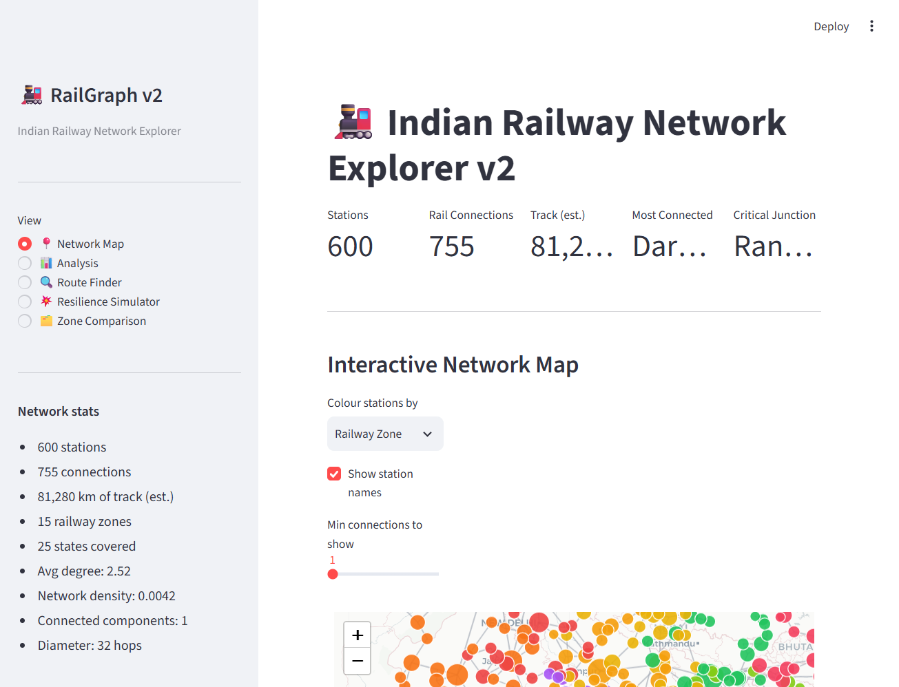

# RailGraph

**Treats India's rail network as a graph and runs real network-science on it — PageRank, betweenness, k-shortest-paths, resilience simulation. No API key, data committed.**

[](https://github.com/siddharthgaur1/rail-graph/actions/workflows/ci.yml) [](https://www.python.org/downloads/) [](LICENSE) [](#quickstart)

> **▶ Live demo: https://siddharthgaur1-siddharthrail-graph-srcapp-hme3vr.streamlit.app/**
> — clickable with **no API key**: 600 stations, 755 links, live folium map, centrality
> and resilience tabs. (First load may take ~30s if the app is asleep.)



## Quickstart

```bash
git clone https://github.com/siddharthgaur1/rail-graph
cd rail-graph
pip install -r requirements.txt
streamlit run src/app.py          # data is already committed — nothing to fetch
```

No API key, no database, no cloud services. See
[Data — read this before treating any number as real](#data--read-this-before-treating-any-number-as-real)
for the dataset's provenance, and [SECURITY.md](SECURITY.md) for the (short) threat
model.

---

Most "railway network" tools are timetable lookups. This treats India's rail
network as a graph and applies actual network-science algorithms to it:
PageRank for station importance beyond raw connection count, betweenness
centrality to find junctions whose failure would disrupt the most traffic,
Yen's k-shortest-paths for real route alternatives, and a resilience
simulator that removes a station and measures the actual topological impact
— does the network split, and by how much does average journey distance
increase.

## Data — read this before treating any number as real

**The network topology is synthetic**, generated by
`scripts/generate_data.py`. ~40 well-known junctions (New Delhi, Mumbai
CSMT, Chennai Central, Nagpur, etc.) use their real names, codes, states,
zones, and approximate coordinates — but the *connectivity between them*,
and all ~560 of the remaining stations, are procedurally generated (a
nearest-neighbor spanning tree per zone plus hub-to-hub bridging), not
scraped from Indian Railways' actual timetable/topology data. Station
importance rankings, "critical junction" claims, and the resilience
simulator's numbers describe *this generated graph*, not the real IR
network. Treat this as a demonstration of the graph algorithms, not a
factual claim about which real station is India's biggest bottleneck.

## Architecture

```
scripts/generate_data.py          (one-time, deterministic — seed=42)
        │
        ▼
data/stations.json, data/edges.json
        │
        ▼
src/graph_analysis.py
   ├── load_graph()            NetworkX graph from JSON, cached
   ├── get_centrality_df()     PageRank, betweenness, closeness, degree
   ├── get_communities()       greedy modularity community detection
   ├── find_k_shortest_paths() Yen's algorithm, up to k alternative routes
   ├── simulate_removal()      remove a station, measure component split
   │                           + sampled avg-path-length change
   └── get_zone_stats()        per-zone aggregates
        │
        ▼
src/app.py (Streamlit, 5 views: Map / Analysis / Route Finder /
            Resilience Simulator / Zone Comparison)
```

## Setup

```bash
pip install -r requirements.txt
python scripts/generate_data.py   # writes data/stations.json, data/edges.json
```

## Running it

```bash
streamlit run src/app.py
pytest tests/ -v
```

## Bugs found and fixed during polish

- **No data shipped at all.** `data/` contained only a `.gitkeep` — the
  README claimed "data files are bundled, no downloads needed," but the app
  would crash immediately on `load_graph()`. Added
  `scripts/generate_data.py` to produce a connected, plausible network (see
  "Data" above).
- **Route Finder could hang indefinitely.** `find_k_shortest_paths()` did
  `list(nx.shortest_simple_paths(...))[:k]` — `shortest_simple_paths` is a
  lazy generator specifically so callers can stop after k results, but
  wrapping it in `list()` before slicing forces it to enumerate *every*
  simple path between the two stations first. On the generated network's
  denser hub layer this is combinatorially expensive; a route between New
  Delhi and Chennai Central hung for 30+ seconds with no result. Fixed with
  `itertools.islice(...)`, which only pulls the first k paths — the same
  query now returns in ~0.03s.

## Design decisions

**Nearest-neighbor spanning tree per zone, not a random graph.** A random
Erdős–Rényi-style graph would produce betweenness/PageRank rankings that
mean nothing geographically. Building each zone as a spanning tree over
actual haversine distance, then bridging zones through their real major
junctions, produces a network where "central" and "high-betweenness" track
something real about the generated geography — even though the specific
edges aren't real IR track.

**Sampling for the resilience simulator, not exhaustive all-pairs shortest
paths.** Computing exact average shortest-path-length change over all
~600×599 pairs after every station removal is O(n²) Dijkstra calls — too
slow for an interactive "click a station, see the impact" UI. Sampling 50
random nodes and computing pairwise distances among just those is O(50²),
fast enough to feel instant, at the cost of the reported percentage being
an estimate rather than exact (the UI says so explicitly).

**Betweenness centrality, not just degree, for "critical junction."** A
station with many direct connections isn't necessarily one that many routes
pass *through* — a hub with high degree but only connecting to a
low-traffic branch matters less than a lower-degree station that sits on
the only path between two large regions. Betweenness captures the latter;
degree alone would misidentify criticality.

## What I'd improve with more time

1. **Real IR topology.** The single biggest gap — this needs actual station
   and track data (open datasets exist, e.g. from data.gov.in or IRCTC-
   adjacent projects) to make any specific claim ("Nagpur is India's biggest
   bottleneck") true rather than an artifact of the generator.
2. **Exact resilience metrics for smaller subgraphs.** The sampling
   approach is a reasonable interactive-UI tradeoff at full scale, but for
   a single zone (≤40 stations) exact all-pairs computation is fast enough
   to not need sampling — worth branching on subgraph size.
3. **Edge capacity/frequency, not just distance.** The graph currently
   weights edges purely by geographic distance. Real network criticality
   also depends on how many trains actually run a given segment — a
   short but low-frequency link isn't as "important" as a short,
   high-frequency one.

## Related projects

- [llm-regression-detector](https://github.com/siddharthgaur1/llm-regression-detector) — CI/CD regression detection for an LLM classifier's eval suite.
- [rag-hybrid-search](https://github.com/siddharthgaur1/rag-hybrid-search) — hybrid dense+BM25 RAG pipeline.
- [finrag](https://github.com/siddharthgaur1/finrag) — hybrid RAG over financial PDFs.
- [querypilot](https://github.com/siddharthgaur1/querypilot) — natural language to SQL agent.
- [ipo-gmp](https://github.com/siddharthgaur1/ipo-gmp) — XGBoost IPO listing-return predictor.
